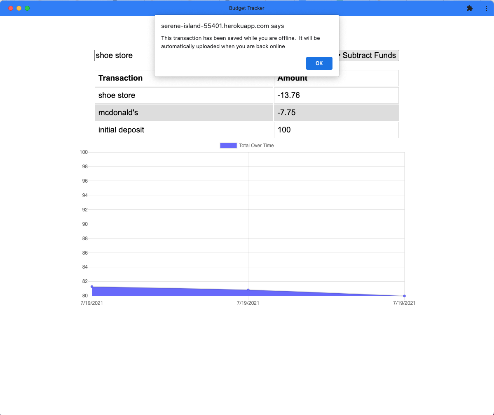
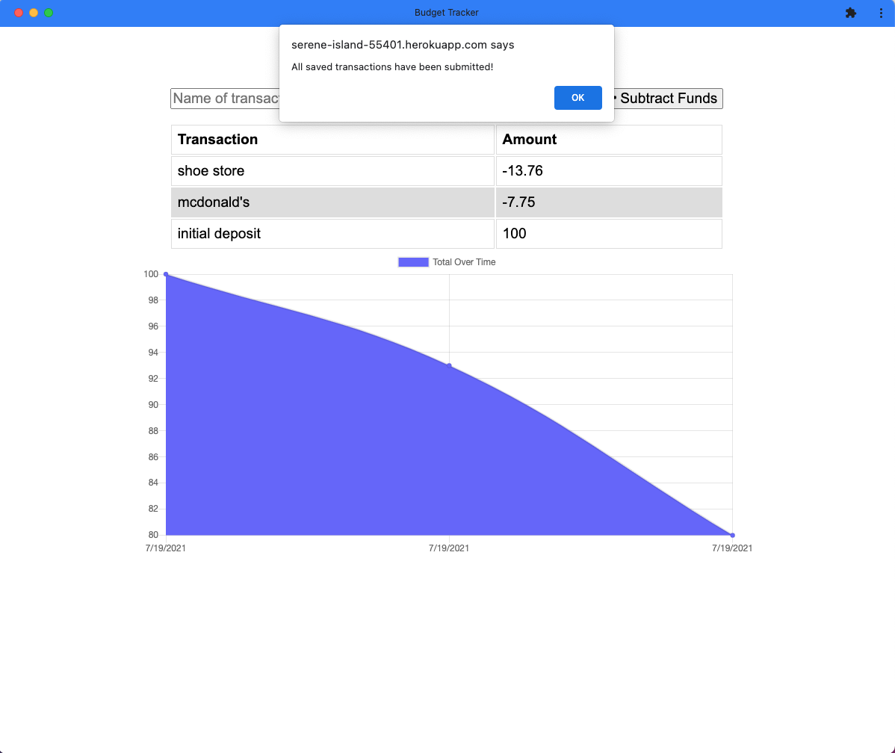

# **Bryan Godwin - Week 19 Challenge**

## **PWA Budget Tracker**

### This challenge is to update an existing budget tracker to allow for offline access and functionality

Three files were added to this project:
- public/js/idb.js - Read and write from indexedDB when internet connection is lost
- public/server-worker.js - Installs a service worker to locally cache all html, css, js & png files
- public/manifest.json - All information need to make this installable as a Progressive Web App (PWA)

### **User Story**

    AS AN avid traveler
    I WANT to be able to track my withdrawals and deposits with or without a data/internet connection
    SO THAT my account balance is accurate when I am traveling 

### **Acceptance Critera**

1.  User can input an expense or deposit while they have no internet connection

    WHEN the user inputs an expense or deposit
    THEN they will receive a notification that they have added an expense or deposit

2.  User changes made while offline are added when users regain internet connection

    WHEN the user reestablishes an internet connection
    THEN the deposits or expenses added while they were offline are added to their transaction history and their totals are updated

### **Challenge 19 - code repository**

<https://github.com/godwinbw/symmetrical-bassoon>

### **Challenge 19 - screenshots**

### **Challenge 19 - link to deployed app

<https://serene-island-55401.herokuapp.com/>
